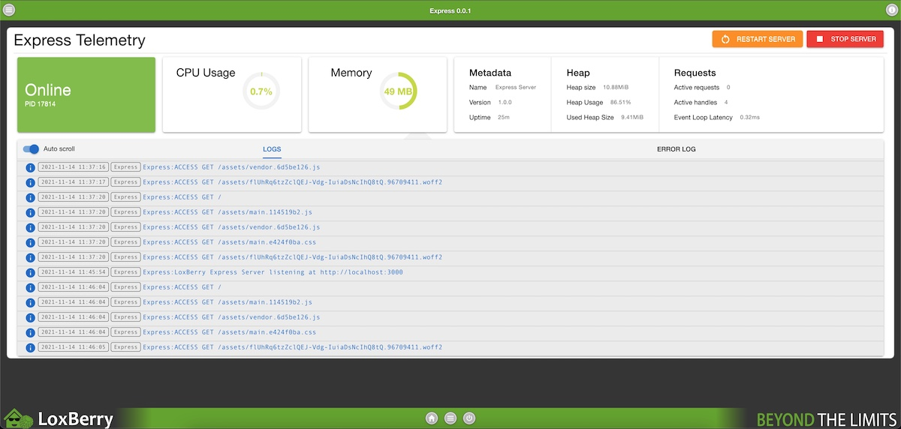

# Loxberry Express Server Plugin

This plugin allows you to create loxberry plugins easily with nodeJS and [ExpressJS] as the backend server.
Normally plugins can be written using Pearl or PHP. NodeJs was possible even before this plugin by providing everything yourself. Websockets can be handled as well.

**Attention**
> The functionality comes a a pluin to the loxberry. If you want to rely on this in your plugin, you need to check if the express plugin is installed on the target loxberry system. In case it's not installed, the installation routine should be stopped with a message to the user that the express plugin is required.

To do such check i'd recomment using the [preroot] file. There you can than easily check the existence with one of the following sequences.
```
#!/bin/bash
EXPRESS=$(perl -e 'use LoxBerry::System;print !LoxBerry::System::plugindata("express") ? 1 : 0;exit;')
if [ $EXPRESS = "1" ]
then
  echo "<ERROR> the plugin youre trying to install requires the Express plugin. Please install this first."
  exit 1;
fi

#Check if the plugin exists and if the version is >= 0.0.1**
REQUIRED_VERSION="0.0.1"
EXPRESS=$(perl -e "use LoxBerry::System;print !LoxBerry::System::plugindata("express") ? 1 : LoxBerry::System::pluginversion('express') ge '$REQUIRED_VERSION' ? 0 : 2;exit;")
if [ $EXPRESS = "1" ]
then
  echo "<ERROR> the plugin youre trying to install requires the Express plugin. Please install this first."
  exit 1;
elif [ $EXPRESS = "2" ]
then
  echo "<ERROR> the plugin youre trying to install requires the Express plugin with a version >= $REQUIRED_VERSION Please upgrade the Express plugin."
exit 1;
fi
```

## Installation

Currently there is not a relase yet and the documentation in the loxwiki is still missing. Never the less can the plugin be installed using the following url:
https://github.com/LoxYourLife/loxberry-express/archive/refs/heads/master.zip


## How does it work

The idea of the plugin is to provide an [ExpressJs] Server where you can hook into. To do that, your plugin needs an `express.js` file in `webfrontend/htmlauth`. This file is automatically picked up by the server as soon as it's receiving a request fopr your plugin. To let Express handle your requests you need to let [Apache2] know, that you want to use the express server instead of apache. This is done using [Apache2] [mod_rewrite] and [mod_proxy] module.

The Express Server runs at port 3000 and allows your plugin to hook into the url path `/plugins/:name`. The Name is the plugins defined `folder_name` from the plugin configuration file `plugin.cfg`. You can also bypass Apache2 by sending a request to `http://<loxberry ip>:3000/plugins/<plugin name>`.

*Attention:*
> Your express.js file is cached during the execution time of the server. Every server restart clears the cache und picks up the file again. Additionally every file change is noticed as well and the cache is invalidated to allow an easy install and upgrade process of your plugin without the need of restarting the express server. Let's assume you have a request counter and every request adds one up. You would write a `let requests = 0` in your file and on every request `request += 1`. This works fine until the server is restarted or the cache invalidated. The counter would then be `0` again.

The module provides also some metrics and the possibility to `start`, `stop` and `restart` the express server. On top all the live logs are provided that you can check for errors and issues easily while developing.



The [ExpressJs] server comes with the [Handlebars] template enginge. The Loxberry layout is provided by 
default. 

Sometime you want to use Websockets, and now that's as easy as defining a route. You can even provide multiple websockets for different purposes in case you want to.


### Express.js handler

To hook into the express server, the file needs to export a function. There is an object passed as a parameter list. The function needs to return the router to be able to work.

Parameters:
* router: The express router to specify your routes / url pathes you want to handle
* static: a symlink to [express.static]
* logger: A logger class with `info`, `debug`, `warn` and `error` methods. See Logger section.
* _: the lodash library

You can decide which parameter you need by using destructing. Let's assume you just want to use the router: `module.exports = ({router}) => {...`. An example with router logger and lodash would look like this: `module.exports = ({router, logger, _}) => { ...`.


```
module.exports = ({router, static}) => {
  return router;
};
```

#### Providing a route
```
module.exports = ({router}) => {
  router.get('/', (req, res) => {
    res.send('ok'); // for normal text content
    res.json({hello: 'world'}); // for json content
    res.render('index', {title: 'MyPluginTitle'}); // to use handlebars template engine
  });
  return router;
};
```

You can of course return more than just one route
```
module.exports = ({router}) => {
  router.get('/', (req, res) => {
    res.render('index', {title: 'MyPluginTitle'});
  });
  router.get('/hello/:name', (req, res) => {
    res.json({hello: req.params.name});
  });
  return router;
};
```

Everything you can do on router level in express you can also do in your plugin.

### Websockets

The Websocket implementation is a custom one inspired by the `express-ws` library. To define a websocket handler in your express file, you can use `router.ws` instead of `router.get`. The provided arguments are:
* the socket
* the request
* a next function

```
const clients = [];
module.exports = ({router, logger}) => {
  router.ws('/foo', (ws, request, next) => {
    ws.on('open', () => clients.push(ws));
    ws.on('message', (message) => {
      logger.debug(`received message: ${message}');
      ws.send(message.toString());
    });
  });

  return router;
};
```

[express.js of this plugin](webfrontend/htmlauth/express.js)

### Rewrite Rules for Apache to use Express

You need to tell [Apache2] that you want to use express and your url path should be redirected to Express.
Therefore you need to write an `.htaccess` file. The file will be placed inside `webfrontend/htmlauth` folder.
Let's assume you write a plugin called "foobar", then the url to the plugin page would be `/admin/plugins/foobar/`. 
By default the index.cgi file in the folder `webfrontend/htmlauth` would be used to render the page. If you want to use the default `router.get('/'...)` route you need to specify a redirect rule. ''Please keep in mind that tose rules only work relatively from `/admin/plugin/foobar/`. Only everything after the main route can be used.

**Attention**:
> `.htaccess` files need to be installed manually. If you follow the guidlines from the [postinstall] wiki than it's just a one liner.
`cp webfrontend/htmlauth/.htaccess $ARGV5/webfrontend/htmlauth/plugins/$ARGV3/.htaccess`

```
RewriteEngine On # this is required
RewriteRule ^index.cgi http://localhost:3000/plugins/express [P,L] #the redirect
```

If you want to redirect all content:
```
RewriteEngine On
RewriteRule ^index.cgi http://localhost:3000/plugins/express [P,L]
RewriteRule ^(.\*) http://localhost:3000/plugins/express/$1 [P,L]
```

Let's assume you just want to use `/admin/plugins/foobar/my-express-routes` for the express server.
```
RewriteEngine On
RewriteRule ^index.cgi http://localhost:3000/plugins/express [P,L]
RewriteRule ^my-express-routes/(.\*) http://localhost:3000/plugins/express/$1 [P,L]
```

### Handlebars template engine

This is the default template engine for the express server and currently the only one. The view/template files are 
located in `webfrontend/htmlauth/views` directory in your plugin. Every file need the filextension `*.hbs`.

views/index.hbs
```
<h1>This is my First Template</h1>
```
To render the file you ned to use `res.render` in the the `express.js` file: `res.render('index', {title: 'Foobar'})`. 
The template is then redered within the loxberry layout. When you use the layout, always provide at least the title.

You can also render your own page, without the layout. Therefore you need to specify `{layout: false}` in the render method.
`res.render('index', {layout: false})`.

The LoxBerry layout has 3 variables you can specify:
* title: the Page title and title for the header
* LB_helpLink: A url for further documentation to your plugin
* LB_help: a template to render (not yet specified and checked)

Those properties are equal to `Loxberry::Web::lbheader($template_title, $helpurl, $helptemplate);`.
More on this on the [Loxberry Documentation](https://www.loxwiki.eu/display/LOXBERRY/LoxBerry%3A%3AWeb%3A%3Albheader)

#### Render with placeholder variables
To know how the syntax for [Handlebars] works, i'd recomment to checkout their documentation.
Here is a basic example:
```
// views/index.hbs
<h1>{{myTitle}}</h1>
<div>Hello {{name}}</div>

// express.js
res.render('index', {title:'My Page title', myTitle: 'Hello World Demo', name: 'Foobar'});

// output wrapped in Layout
<h1>Hello World Demo<h1>
<div>Hello Foobar</div>
```

The simplified layout would look like this: (title is replaced with "My Page Title" and body is replaced with your
index.hbs view.

```
<!DOCTYPE html>
<html>
<head>
  <meta charset="utf-8">
  <title>{{title}}</title>
</head>
<body>
  {{{body}}}
</body>
</html>
```

## Logger

The plugin uses a custom Logger class for a unified logfile. This logfile is than used to show the logs on the plugin page. Loggers are separated by the plugin who uses the logger. The express plugin flags all entries with "Express" whereas a plugin "my_cool_plugin" would be flaged with "My Cool Plugin".
This works by default, you and don't need to think about this.

The logfiles are stored in `LBHOME/logs/plugins/express/` and separated.
Errors will be written into `express-errors.log` and normal logs into `express.log`.

At the moment all logs are written, but there is the plan that you can condfigfure on your loxberry which logs you want to write. Fo example only `warn` and `error`. But it doesn't work yet.

### Log methods
* info(message: String)
* debug(message: String)
* warn(message: String)
* error(message: String, error: Exception)

[ExpressJs]: https://expressjs.com/
[Apache2]: https://httpd.apache.org/
[mod_rewrite]: https://httpd.apache.org/docs/2.4/mod/mod_rewrite.html
[mod_proxy]: https://httpd.apache.org/docs/2.4/mod/mod_proxy.html
[Handlebars]: https://handlebarsjs.com/
[express.static]: https://expressjs.com/de/starter/static-files.html
[postinstall]: https://www.loxwiki.eu/pages/viewpage.action?pageId=23462653#Pluginf%C3%BCrdenLoxberryentwickeln(abVersion1.x)-Rootverzeichnis-Datei:postinstall.shYellowOptional
[preroot]: https://www.loxwiki.eu/pages/viewpage.action?pageId=23462653#Pluginf%C3%BCrdenLoxberryentwickeln(abVersion1.x)-Rootverzeichnis-Datei:preroot.shYellowOptional
